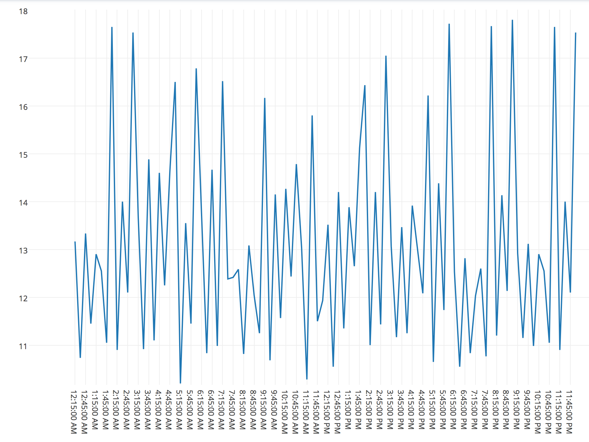

# when

```
>> node index.js GOOGLE_MAPS_API_KEY '1730 Minor Ave, Seattle, WA 98101, USA' '1101 Dexter Ave N, Seattle, WA 98109' PLOTLY_USERNAME PLOTLY_API_KEY
{ msg:
   { streamstatus: undefined,
     url: 'https://plot.ly/~lowellbander/0',
     message: 'High five! You successfuly sent some data to your account on plotly. View your plot in your browser at https://plot.ly/~lowellbander/0 or inside your plot.ly account where it is named \'date-axes\'',
     warning: '',
     filename: 'date-axes',
     error: '' } }
```

